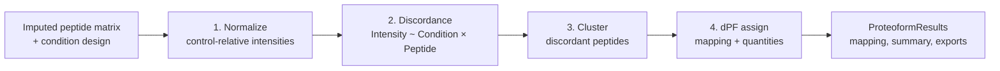

<!-- markdownlint-disable MD033 MD036 MD041 MD045 -->
<p align="center">
    <!--  -->
    <strong>ProteoForge</strong>
</p>

<p align="center">
    <strong>Differential proteoform discovery for bottom-up proteomics</strong>
</p>

<p align="center">
    <a href="#references"></a>
    <a href="docs/index.md"></a>
    <a href="https://github.com/eneskemalergin/ProteoForge/actions"></a>
    <a href="LICENSE"></a>
    <a href="CHANGELOG.md"></a>
</p>
<p align="center">
    <a href="#installation"></a>
    <a href="#installation"></a>
    <a href="#installation"></a>
    <a href="#installation"></a>
</p>
<p align="center">
    <a href="https://github.com/eneskemalergin/ProteoForge"></a>
</p>

> **Note:** Modules 1 to 3 ship today (prepare, discordance, Ward clustering, dPF assignment). The unified `discover()` API and HTML report are planned.

ProteoForge discovers differential proteoforms from an imputed peptide matrix and a condition design with a control. Peptides that break rank with their siblings are grouped into dPF units: canonical signal (`dPF_0`), multi-peptide proteoforms (`dPF_1+`), and singleton discordants (`dPF_-1`).

The package does not impute, search, or quantify. Upstream imputation is required.

**Available now:** long-format peptide I/O, validation, control-relative normalization (`prepare()`), discordance (`run_discordance()`), Ward clustering (`run_cluster()`), and dPF assignment (`assign_proteoforms()`). Core discordance backends: **RLM** (default) and **WLS**.

## Pipeline

Four modules from the ProteoForge method. Modules 1 to 3 are available in the current package. Module 4 (`ProteoformResults`, `discover()`) is planned.



**Module 2 (discordance)**

- RLM (default) and WLS (mask-derived or precomputed weights)
- Two-step correction (`bonferroni` within, `fdr_bh` global by default; also `holm`, `hommel`, `hochberg`, `BY`, `qvalue`)
- `p_adjust()` / `p_adjust_by_group()` exported from `proteoforge`; IHW library under `proteoforge.correction.ihw` (not in config yet)
- Shape-group batching and parallel RLM pool

**Module 3 (clustering and dPF)**

- Ward linkage on peptide condition profiles with hybrid outlier cut (default)
- dPF mapping (`dPF_0`, `dPF_-1`, positive differential proteoforms)

## Installation

Python 3.12 or newer (CI gates on 3.12). Runtime: NumPy 2.2+, Polars 1.26+, Numba 0.61+, PyYAML, tqdm.

PyPI follows v0.1.0. Until then, install from source:

```bash
git clone https://github.com/eneskemalergin/ProteoForge.git
cd ProteoForge
uv sync
```

Optional extras: `plots`, `interactive`, `docs`. The `cli` extra is reserved for a future Typer CLI. Clustering geometry uses Numba JIT in `proteoforge.clustering`.

```bash
pip install -e ".[plots,docs]"
```

## Quick start

### Available now

Load a long-format peptide parquet, validate, normalize, run discordance, cluster discordant proteins, and assign dPF IDs. Experimental design and sample scope live in the config YAML.

```python
from proteoforge import (
    Config,
    assign_proteoforms,
    prepare_from_parquet,
    run_cluster,
    run_discordance,
)

config = Config.from_yaml_path("config.yaml")
dataset = prepare_from_parquet("peptides.parquet", config)
discordance = run_discordance(dataset)
clusters = run_cluster(dataset, discordance)
mapping = assign_proteoforms(dataset, discordance, clusters)

mapping.table
```

Example `config.yaml`:

```yaml
control_condition: control
conditions:
  control: [S1, S2]
  treated: [S3, S4]
min_peptides: 4
model: rlm
fdr: 0.001
correction_within: bonferroni
correction_global: fdr_bh
```

For in-memory tables use `prepare(df, config)` or `prepare(lazy_frame, config)`. Prefer `prepare_from_parquet` when starting from a file: it lazy-scans, projects columns, and filters to configured samples before materialization.

To inspect harmonized long-format rows without normalizing, use `read_peptides(path, config)`.

### Not yet available

The unified discovery API below is planned. Use the module calls above today.

```python
import proteoforge as pf

config = pf.Config.from_yaml_path("config.yaml")
result = pf.discover(data="peptides.parquet", config=config)

result.summary()
result.mapping
result.dpf_quantities()
result.save("result.pfg")
```

```bash
proteoforge discover peptides.parquet --config config.yaml -o results/
```

## Documentation

User documentation:

- [Documentation home](docs/index.md)
- [Configuration](docs/config.md)
- [Input and output](docs/io.md)
- [Prepare](docs/prepare.md)
- [Normalization](docs/normalization.md)
- [Discordance](docs/discordance.md)
- [Multiple-testing correction](docs/correction.md)
- [Clustering](docs/clustering.md)
- [PreparedDataset](docs/prepared-dataset.md)
- [Changelog](CHANGELOG.md)

Build the docs site locally:

```bash
uv sync --extra docs
uv run mkdocs serve
```

## Development

```bash
uv sync
uv run pre-commit install
```

Mirror CI before pushing:

```bash
uv run ruff check .
uv run ruff format --check .
uv run mypy
uv run pytest tests --cov=proteoforge --cov-report=term-missing
```

Tests use small fixtures in `tests/fixtures/`. For bundled parquet configs used in integration tests, see `load_fixture_bundle()` in `proteoforge.fixture`.

Tag `vX.Y.Z` to trigger trusted PyPI publish (`hatch-vcs` versioning).

## References

- ProteoForge manuscript (bioRxiv 2025)
- [PeCorA](https://doi.org/10.1021/acs.jproteome.0c00602), [COPF](https://doi.org/10.1038/s41467-021-24030-x)
- [ProteoForge analysis repository](https://github.com/LangeLab/ProteoForge_Analysis) (manuscript reference implementation)

## License

MIT License. See [LICENSE](LICENSE) for details.

<p align="center">
    <em>Frost thins the thick stem,</em><br />
    <em>Peptides break their silent bond,</em><br />
    <em>New forms now emerge.</em>
</p>
