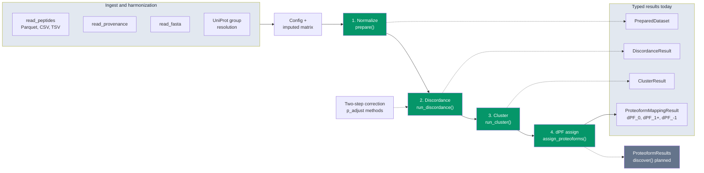

<!-- markdownlint-disable MD033 MD041 -->
<p align="center">
  
</p>

<p align="center">
  Imputation-aware discovery of differential proteoforms from bottom-up proteomics peptide data.
</p>

<p align="center">
  
  
  
  <a href="https://github.com/eneskemalergin/ProteoForge/actions/workflows/ci.yml"></a>
  <a href="https://doi.org/10.1021/acs.jproteome.5c01235"></a>
  
</p>

<p align="center">
  <a href="CHANGELOG.md"></a>
  <a href="CITATION.cff"></a>
  <a href="https://github.com/eneskemalergin/ProteoForge/issues"></a>
</p>

> **Note:** Modules 1 to 3 ship today (prepare, discordance, Ward clustering, dPF assignment). The unified `discover()` API and HTML report are planned.

ProteoForge discovers differential proteoforms from an imputed peptide matrix and a condition design with a control. Peptides that break rank with their siblings are grouped into dPF units: canonical signal (`dPF_0`), multi-peptide proteoforms (`dPF_1+`), and singleton discordants (`dPF_-1`).

The package does not impute, search, or quantify. Upstream imputation is required.

**Available now:** long-format peptide I/O, validation, control-relative normalization (`prepare()`), discordance (`run_discordance()`), Ward clustering (`run_cluster()`), and dPF assignment (`assign_proteoforms()`). Core discordance backends: **RLM** (default) and **WLS**.

## Pipeline

Four analysis modules from the ProteoForge method (solid arrows). Modules 1 to 3 ship today. Module 4 (`ProteoformResults`, `discover()`) is planned. Dotted arrows are ingest helpers, correction inside discordance, per-stage result types, and the future unified API.


```mermaid
flowchart LR
  subgraph ingest ["Ingest and harmonization"]
    direction TB
    i1["read_peptides\nParquet, CSV, TSV"]
    i2["read_provenance"]
    i3["read_fasta"]
    i4["UniProt group\nresolution"]
  end

  IN["Config +\nimputed matrix"]
  N["1. Normalize\nprepare()"]
  D["2. Discordance\nrun_discordance()"]
  C["3. Cluster\nrun_cluster()"]
  P["4. dPF assign\nassign_proteoforms()"]

  subgraph results ["Typed results today"]
    direction TB
    r1["PreparedDataset"]
    r2["DiscordanceResult"]
    r3["ClusterResult"]
    r4["ProteoformMappingResult\ndPF_0, dPF_1+, dPF_-1"]
  end

  PR["ProteoformResults\ndiscover() planned"]

  CORR["Two-step correction\np_adjust methods"]

  ingest --> IN
  IN --> N --> D --> C --> P
  N -.-> r1
  D -.-> r2
  C -.-> r3
  P --> r4
  P -.-> PR
  CORR -.-> D

  style N fill:#059669,color:#fff
  style D fill:#059669,color:#fff
  style C fill:#059669,color:#fff
  style P fill:#059669,color:#fff
  style PR fill:#64748b,color:#fff
  style ingest fill:#e2e8f0,color:#1e293b
  style results fill:#e2e8f0,color:#1e293b
```

**Ingest** (`proteoforge.io`): `read_peptides()`, `read_provenance()`, `read_fasta()`; semicolon-separated accessions collapse to a canonical UniProt-length representative during harmonization.

**Module 2 (discordance)**

- RLM (default) and WLS (mask-derived or precomputed weights)
- Two-step correction (`bonferroni` within, `fdr_bh` global by default; also `holm`, `hommel`, `hochberg`, `BY`, `qvalue`)
- `p_adjust()` / `p_adjust_by_group()` exported from `proteoforge` (`fdr_bh`, `qvalue`, `hommel`, etc.)
- Shape-group batching and parallel RLM pool

**Module 3 (clustering and dPF)**

- Ward linkage on peptide condition profiles with hybrid outlier cut (default)
- dPF mapping (`dPF_0`, `dPF_-1`, positive differential proteoforms)

**Results today:** call modules in sequence and keep `PreparedDataset`, `DiscordanceResult`, `ClusterResult`, and `ProteoformMappingResult` separately. **Planned:** `discover()` returning `ProteoformResults` (mapping, summary, file export).

## Installation

Python 3.12 or newer (CI gates on 3.12). Runtime: NumPy 2.2+, Polars 1.26+, Numba 0.61+, PyYAML, tqdm.

PyPI follows v0.1.0. Until then, install from source:

```bash
git clone https://github.com/eneskemalergin/ProteoForge.git
cd ProteoForge
uv sync
```

Clustering geometry and the q-value spline use Numba JIT; the first call compiles and caches the kernels.

## Quick start

### Available now

Load a long-format peptide parquet, validate, normalize, run discordance, cluster all proteins in scope, and assign dPF IDs. Experimental design and sample scope live in the config YAML.

```python
from proteoforge import (
    Config,
    assign_proteoforms,
    prepare_from_parquet,
    run_cluster,
    run_discordance,
)

config = Config.from_yaml_path("config.yaml")
dataset = prepare_from_parquet("peptides.parquet", config)
discordance = run_discordance(dataset)
clusters = run_cluster(dataset, discordance)
mapping = assign_proteoforms(dataset, discordance, clusters)

mapping.table
```

Example `config.yaml`:

```yaml
control_condition: control
conditions:
  control: [S1, S2]
  treated: [S3, S4]
min_peptides: 4
model: rlm
fdr: 0.001
correction_within: bonferroni
correction_global: fdr_bh
```

For in-memory tables use `prepare(df, config)` or `prepare(lazy_frame, config)`. Prefer `prepare_from_parquet` when starting from a file: it lazy-scans, projects columns, and filters to configured samples before materialization.

To inspect harmonized long-format rows without normalizing, use `read_peptides(path, config)`.

### Not yet available

The unified discovery API below is planned. Use the module calls above today.

```python
import proteoforge as pf

config = pf.Config.from_yaml_path("config.yaml")
result = pf.discover(data="peptides.parquet", config=config)

result.summary()
result.mapping
result.dpf_quantities()
result.save("result.pfg")
```

```bash
proteoforge discover peptides.parquet --config config.yaml -o results/
```

## Documentation

The user guide is being rewritten. Until it is published, the docstrings of the public functions (`help(proteoforge.prepare)`) and the [changelog](CHANGELOG.md) describe current behavior.

## Development

```bash
uv sync
uv run pre-commit install
```

Mirror CI before pushing:

```bash
uv run ruff check .
uv run ruff format --check .
uv run mypy
uv run pytest tests --cov=proteoforge --cov-report=term-missing
```

Tests use small fixtures in `tests/fixtures/`. For bundled parquet configs used in integration tests, use `load_fixture_bundle()` from the top-level `proteoforge` import.

Tag `vX.Y.Z` to trigger trusted PyPI publish (`hatch-vcs` versioning).

## Citation

If you use ProteoForge, please cite:

> Ergin, E. K.; Conrrero, A.; Ferguson, K. M.; Lange, P. F. ProteoForge: An Imputation-Aware Framework for Differential Proteoform Discovery in Bottom-Up Proteomics. *J. Proteome Res.* **2026**, *25* (7), 3384–3398. <https://doi.org/10.1021/acs.jproteome.5c01235>

```bibtex
@article{Ergin2026ProteoForge,
  author  = {Ergin, Enes K. and Conrrero, Agustina and Ferguson, Kirsty M. and Lange, Philipp F.},
  title   = {ProteoForge: An Imputation-Aware Framework for Differential Proteoform Discovery in Bottom-Up Proteomics},
  journal = {Journal of Proteome Research},
  year    = {2026},
  volume  = {25},
  number  = {7},
  pages   = {3384--3398},
  doi     = {10.1021/acs.jproteome.5c01235}
}
```

`CITATION.cff` carries the same reference for GitHub's "Cite this repository" button.

## References

- [PeCorA](https://doi.org/10.1021/acs.jproteome.0c00602), [COPF](https://doi.org/10.1038/s41467-021-24030-x)
- [ProteoForge analysis repository](https://github.com/LangeLab/ProteoForge_Analysis) (reference implementation used in the article)

## License

MIT License. See [LICENSE](LICENSE) for details.

<p align="center">
    <em>Frost thins the thick stem,</em><br />
    <em>Peptides break their silent bond,</em><br />
    <em>New forms now emerge.</em>
</p>
