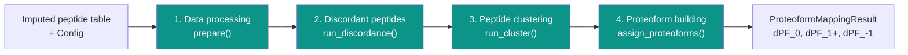

<!-- markdownlint-disable MD033 MD041 -->
<p align="center">
  <picture>
    <source media="(prefers-color-scheme: dark)" srcset="https://raw.githubusercontent.com/eneskemalergin/ProteoForge/main/assets/proteoforge-readme-header-dark.svg">
    
  </picture>
</p>

<p align="center">
  Imputation-aware differential proteoform discovery: find the peptides that break rank with their protein and group them into proteoforms.
</p>

<p align="center">
  
  
  <a href="https://github.com/eneskemalergin/ProteoForge/actions/workflows/ci.yml"></a>
  <!-- <a href="https://codecov.io/gh/eneskemalergin/ProteoForge"></a> -->
  
</p>

<p align="center">
  <a href="https://doi.org/10.1021/acs.jproteome.5c01235"></a>
  <a href="https://github.com/LangeLab/ProteoForge_Analysis"></a>
  <a href="CITATION.cff"></a>
  <a href="CHANGELOG.md"></a>
  <a href="https://github.com/eneskemalergin/ProteoForge/issues"></a>
</p>

> [!NOTE]
> All four stages of the published method ship today as separate calls: `prepare()`, `run_discordance()`, `run_cluster()`, and `assign_proteoforms()`. A single `discover()` call and a command-line workflow are planned. The package is pre-1.0, and the API can still change.

ProteoForge finds differential proteoforms in bottom-up proteomics data. Protein by protein, it tests which peptides change across conditions differently from their sibling peptides, clusters peptides with similar condition profiles, and assigns each peptide to a differential proteoform (dPF):

- `dPF_0`: the canonical proteoform, peptides that move with the protein.
- `dPF_1`, `dPF_2`, ...: a multi-peptide cluster that contains at least one discordant peptide.
- `dPF_-1`: a single discordant peptide in a cluster of its own, often a PTM or a variant.

**Imputation-aware.** ProteoForge does not impute. It takes an already-imputed peptide matrix and accounts for imputation in the test itself. The default robust linear model (RLM, Huber) down-weights outlying values without extra input. The weighted model (WLS) uses imputation provenance for each value: measured values get weight 1, values imputed for a whole condition get a configurable weight (default 0.5), and sparsely imputed values get a weight near zero.

ProteoForge does not search, identify, or quantify peptides; it starts from a peptide-level quantitative table.

## Method

The four stages of the method, as described in the article, and the function that runs each one:


```mermaid
flowchart LR
  IN["Imputed peptide table<br/>+ Config"] --> N["1. Data processing<br/>prepare()"]
  N --> D["2. Discordant peptides<br/>run_discordance()"]
  D --> C["3. Peptide clustering<br/>run_cluster()"]
  C --> P["4. Proteoform building<br/>assign_proteoforms()"]
  P --> R["ProteoformMappingResult<br/>dPF_0, dPF_1+, dPF_-1"]

  style N fill:#0D9488,color:#fff
  style D fill:#0D9488,color:#fff
  style C fill:#0D9488,color:#fff
  style P fill:#0D9488,color:#fff
```

1. **Data processing** (`prepare()`): reads the long peptide table, validates it against the design in `Config`, and applies control-relative normalization: $\log_2$ when needed, per-sample z-scoring, then subtraction of each peptide's mean in the control condition.
2. **Discordant peptides** (`run_discordance()`): for every peptide, fits a one-vs-rest interaction model, $\text{Intensity} \sim \text{Condition} \times \text{Peptide}$, against the other peptides of its protein. The interaction p-values are corrected in two steps, within each protein and then across proteins. Defaults: RLM, Bonferroni within, Benjamini-Hochberg across, and a peptide is discordant at adjusted $p \le 0.001$.
3. **Peptide clustering** (`run_cluster()`): clusters each protein's peptide condition profiles with Ward linkage and cuts the tree with the hybrid outlier strategy by default.
4. **Proteoform building** (`assign_proteoforms()`): turns the clusters and discordance calls into dPF IDs.

Each stage returns a typed result (`PreparedDataset`, `DiscordanceResult`, `ClusterResult`, `ProteoformMappingResult`) that the next stage takes as input.

Supporting functions:

- **Input** (`proteoforge.io`): `read_peptides()` reads Parquet, CSV, or TSV; `read_provenance()` attaches imputation provenance; `read_fasta()` reads protein sequences. A semicolon-separated protein group is reduced to one representative, preferring a six-character UniProt accession.
- **Multiple-testing correction**: `p_adjust()` and `p_adjust_by_group()` with `bonferroni`, `holm`, `hochberg`, `hommel`, `fdr_bh`, `BY`, and `qvalue` (Storey).

## Installation

ProteoForge needs Python 3.12 or newer. Runtime dependencies: NumPy 2.2+, Polars 1.26+, Numba 0.61.2+, PyYAML, and tqdm. CI tests Python 3.12 on Linux (x64, arm64) and macOS (arm64), and Python 3.13 and 3.14 on Linux x64. Windows is not tested.

PyPI releases start with v0.1.0. Until then, install from GitHub:

```bash
pip install "git+https://github.com/eneskemalergin/ProteoForge.git"
```

or work from a clone with [uv](https://docs.astral.sh/uv/):

```bash
git clone https://github.com/eneskemalergin/ProteoForge.git
cd ProteoForge
uv sync
```

Clustering and the q-value spline use Numba; the first call compiles the kernels and caches them for later runs.

## Quick start

Run the four stages on a long-format peptide table. The experimental design and sample scope live in the config file.

```python
from proteoforge import (
    Config,
    assign_proteoforms,
    prepare_from_parquet,
    run_cluster,
    run_discordance,
)

config = Config.from_yaml_path("config.yaml")
dataset = prepare_from_parquet("peptides.parquet", config)
discordance = run_discordance(dataset)
clusters = run_cluster(dataset, discordance)
mapping = assign_proteoforms(dataset, discordance, clusters)

mapping.table  # one row per peptide, with its cluster and dPF ID
```

Example `config.yaml`:

```yaml
control_condition: control
conditions:
  control: [S1, S2]
  treated: [S3, S4]
min_peptides: 4
model: rlm
fdr: 0.001
correction_within: bonferroni
correction_global: fdr_bh
```

The peptide table is in long format, one row per peptide and sample, with columns for protein, peptide, sample, and intensity; `Config.column_map` maps your column names onto these. Each condition needs at least two samples, and every protein needs at least `min_peptides` peptides (default 4); `prepare()` rejects a table that breaks either rule and names the offending proteins, so filter low-coverage proteins beforehand.

For tables already in memory, use `prepare(frame, config)` with a Polars `DataFrame` or `LazyFrame`. For files, `prepare_from_parquet()` is the better choice: it scans lazily, reads only the needed columns, and filters to the configured samples before loading. To inspect the harmonized input without normalizing it, use `read_peptides(path, config)`.

## Documentation

The user guide is being rewritten. Until it is published, the docstrings of the public functions (`help(proteoforge.run_discordance)`) and the [changelog](CHANGELOG.md) describe current behavior.

## Development

```bash
uv sync
uv run pre-commit install
```

Run the same checks as CI before pushing:

```bash
uv run ruff check .
uv run ruff format --check .
uv run mypy
uv run pytest --cov=proteoforge --cov-report=term-missing
```

Tests use small fixtures in `tests/fixtures/`. `load_fixture_bundle()` loads a dataset described by a `manifest.yaml` (a peptide file plus its config).

Releases start at v0.1.0: pushing a `vX.Y.Z` tag builds the package and publishes it to PyPI through trusted publishing, with the version taken from the tag.

## Citation

If you use ProteoForge, please cite:

> Ergin, E. K.; Conrrero, A.; Ferguson, K. M.; Lange, P. F. ProteoForge: An Imputation-Aware Framework for Differential Proteoform Discovery in Bottom-Up Proteomics. *J. Proteome Res.* **2026**, *25* (7), 3384–3398. <https://doi.org/10.1021/acs.jproteome.5c01235>

```bibtex
@article{Ergin2026ProteoForge,
  author  = {Ergin, Enes K. and Conrrero, Agustina and Ferguson, Kirsty M. and Lange, Philipp F.},
  title   = {ProteoForge: An Imputation-Aware Framework for Differential Proteoform Discovery in Bottom-Up Proteomics},
  journal = {Journal of Proteome Research},
  year    = {2026},
  volume  = {25},
  number  = {7},
  pages   = {3384--3398},
  doi     = {10.1021/acs.jproteome.5c01235}
}
```

`CITATION.cff` carries the same reference for GitHub's "Cite this repository" button.

### Reproducing the article

The analyses in the article were produced with the code in [LangeLab/ProteoForge_Analysis](https://github.com/LangeLab/ProteoForge_Analysis): the benchmarks, the simulation studies, and the hypoxia (NSCLC) application, as notebooks and scripts with setup instructions for Python and R. A snapshot with the input data and rendered notebooks is archived on Zenodo ([10.5281/zenodo.17795845](https://doi.org/10.5281/zenodo.17795845)). That repository is the version used in the article; this package is its maintained reimplementation, so defaults and numbers can differ between the two.

## References

- PeCorA: Dermit, M., et al. Peptide Correlation Analysis (PeCorA) Reveals Differential Proteoform Regulation. *J. Proteome Res.* 2021, *20* (4), 1972-1980. <https://doi.org/10.1021/acs.jproteome.0c00602>
- COPF: Bludau, I., et al. Systematic detection of functional proteoform groups from bottom-up proteomic datasets. *Nat. Commun.* 2021, *12*, 3810. <https://doi.org/10.1038/s41467-021-24030-x>

## License

MIT License. See [LICENSE](LICENSE) for details.

<p align="center">
    <em>Frost thins the thick stem,</em><br />
    <em>Peptides break their silent bond,</em><br />
    <em>New forms now emerge.</em>
</p>
