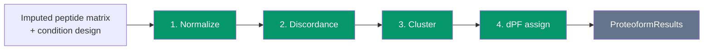

# ProteoForge documentation

ProteoForge discovers differential proteoforms from an imputed peptide matrix and a condition design with a control. The installable package covers configuration, long-format peptide I/O, input validation, control-relative normalization (Module 1), peptide discordance with core RLM and WLS backends (Module 2), and Ward clustering with dPF assignment (Module 3). The unified `discover()` API and HTML report are not implemented yet.

## Pipeline



Modules 1 to 3 (green) are available in the current package. `ProteoformResults` and `discover()` (Phase 4) are planned but not available yet.

## Reading order

1. [Configuration](config.md): experimental design, column mapping, YAML loading
2. [Input and output](io.md): supported formats, canonical columns, harmonization
3. [Prepare](prepare.md): `prepare()` and `prepare_from_parquet()` end to end
4. [Normalization](normalization.md): control-relative intensity transform (Module 1)
5. [Discordance](discordance.md): `run_discordance()` and WLS/RLM backends (Module 2)
6. [Clustering](clustering.md): `run_cluster()` and `assign_proteoforms()` (Module 3)
7. [PreparedDataset](prepared-dataset.md): output contract between prepare and downstream modules

## Quick example

```python
from proteoforge import (
    Config,
    assign_proteoforms,
    prepare_from_parquet,
    run_cluster,
    run_discordance,
)

config = Config.from_yaml_path("config.yaml")
dataset = prepare_from_parquet("peptides.parquet", config)
discordance = run_discordance(dataset)
clusters = run_cluster(dataset, discordance)
mapping = assign_proteoforms(dataset, discordance, clusters)

mapping.n_differential_peptides
```

## Project links

- [Repository README](https://github.com/eneskemalergin/ProteoForge)
- [Changelog](https://github.com/eneskemalergin/ProteoForge/blob/main/CHANGELOG.md)
- [License](https://github.com/eneskemalergin/ProteoForge/blob/main/LICENSE) (MIT)
