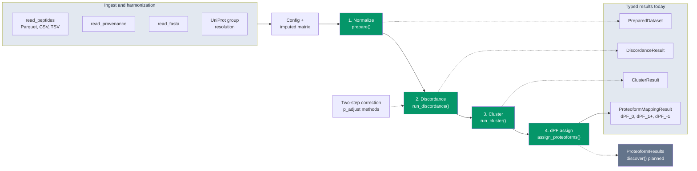

# ProteoForge documentation

ProteoForge discovers differential proteoforms from an imputed peptide matrix and a condition design with a control. The installable package covers configuration, long-format peptide I/O, validation, control-relative normalization inside `prepare()` (Module 1), peptide discordance with RLM and WLS backends (Module 2), two-step multiple-testing correction, Ward clustering, and dPF assignment (Module 3). The unified `discover()` API and HTML report are not implemented yet.

## Shipped today vs planned

**Shipped:**

- `Config`, YAML/JSON loading, column mapping
- `read_peptides()`, `prepare()`, `prepare_from_parquet()`
- `run_discordance()` with RLM and WLS, two-step correction (`bonferroni` / `fdr_bh` defaults, plus `holm`, `hommel`, `hochberg`, `BY`, `qvalue`)
- `p_adjust()`, `p_adjust_by_group()`, `VALID_METHODS` on the top-level `proteoforge` import
- `run_cluster()`, `assign_proteoforms()`, Numba clustering geometry
- `load_fixture_bundle()` for committed test fixtures

**Planned:**

- `discover()`, `ProteoformResults`, HTML report, Typer CLI (`proteoforge discover`)
- `model="ebayes"`
- Vendor-wide ingest, plotting extras beyond optional `plots` dependency

See [Changelog](https://github.com/eneskemalergin/ProteoForge/blob/main/CHANGELOG.md) for release history.

## Pipeline

Solid arrows are the four analysis modules. Dotted arrows are ingest helpers, two-step correction inside discordance, typed result objects at each stage, and the planned unified API.



Modules 1 to 3 (green) are `prepare()`, `run_discordance()`, `run_cluster()`, and `assign_proteoforms()`. Module 4 (grey) is not available yet.

Stage map (entry point, primary output):

- **Ingest:** `read_peptides()`, `read_provenance()`, `read_fasta()`; harmonization and UniProt-style group resolution before `prepare()` ([Input and output](io.md))
- **Normalize:** `prepare()` / `prepare_from_parquet()` to `PreparedDataset` with `intensity_normalized` on each row
- **Discordance:** `run_discordance()` to `DiscordanceResult.table` with `raw_p_value`, `within_p_value`, `adjusted_p_value`, `is_discordant`. Correction via `p_adjust_by_group` then `p_adjust` ([Multiple-testing correction](correction.md))
- **Cluster:** `run_cluster()` to `ClusterResult.table` with `cluster_id` on discordant proteins
- **dPF assign:** `assign_proteoforms()` to `ProteoformMappingResult.table` with `dpf_id` (`dPF_0`, `dPF_1+`, `dPF_-1`)
- **Planned:** `discover()` to `ProteoformResults` (mapping, summary, exports in one object)

## Reading order

1. [Configuration](config.md): experimental design, column mapping, correction and clustering fields
2. [Input and output](io.md): supported formats, canonical columns, provenance
3. [Prepare](prepare.md): `prepare()` and `prepare_from_parquet()`
4. [PreparedDataset](prepared-dataset.md): handoff contract before Module 2
5. [Normalization](normalization.md): control-relative transform inside prepare (Module 1 detail)
6. [Discordance](discordance.md): `run_discordance()`, models, batching, outputs
7. [Multiple-testing correction](correction.md): method list, two-step logic, `p_adjust` API
8. [Clustering](clustering.md): `run_cluster()` and `assign_proteoforms()` (Module 3)

## Quick example

```python
from proteoforge import (
    Config,
    assign_proteoforms,
    prepare_from_parquet,
    run_cluster,
    run_discordance,
)

config = Config.from_yaml_path("config.yaml")
dataset = prepare_from_parquet("peptides.parquet", config)
discordance = run_discordance(dataset)
clusters = run_cluster(dataset, discordance)
mapping = assign_proteoforms(dataset, discordance, clusters)

mapping.n_differential_peptides
```

Pass the same `Config` (or matching frozen values) on `PreparedDataset`, `DiscordanceResult`, and downstream results. `run_cluster()` and `assign_proteoforms()` compare configs and raise on mismatch.

## Project links

- [Repository README](https://github.com/eneskemalergin/ProteoForge)
- [Changelog](https://github.com/eneskemalergin/ProteoForge/blob/main/CHANGELOG.md)
- [License](https://github.com/eneskemalergin/ProteoForge/blob/main/LICENSE) (MIT)
