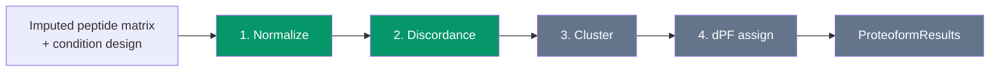

# ProteoForge documentation

ProteoForge discovers differential proteoforms from an imputed peptide matrix and a condition design with a control. The installable package (**v0.0.2**) covers configuration, long-format peptide I/O, input validation, control-relative normalization (Module 1), and peptide discordance with core RLM and WLS backends (Module 2).

Clustering, dPF assignment, and the unified `discover()` API are not implemented yet.

## Pipeline



Modules 1 and 2 (green) ship in v0.0.2. Later modules are planned but not available in this release.

## Reading order

1. [Configuration](config.md): experimental design, column mapping, YAML loading
2. [Input and output](io.md): supported formats, canonical columns, harmonization
3. [Prepare](prepare.md): `prepare()` and `prepare_from_parquet()` end to end
4. [Normalization](normalization.md): control-relative intensity transform (Module 1)
5. [Discordance](discordance.md): `run_discordance()` and WLS/RLM backends (Module 2)
6. [PreparedDataset](prepared-dataset.md): output contract between prepare and discordance

## Quick example

```python
from proteoforge import Config, prepare_from_parquet, run_discordance

config = Config.from_yaml_path("config.yaml")
dataset = prepare_from_parquet("peptides.parquet", config)
result = run_discordance(dataset)

dataset.peptides.height   # n_peptides × n_samples long rows
result.n_discordant
result.discordant.height  # discordant peptides only
```

## Project links

- [Repository README](https://github.com/eneskemalergin/ProteoForge)
- [Changelog](https://github.com/eneskemalergin/ProteoForge/blob/main/CHANGELOG.md)
- [License](https://github.com/eneskemalergin/ProteoForge/blob/main/LICENSE) (MIT)
